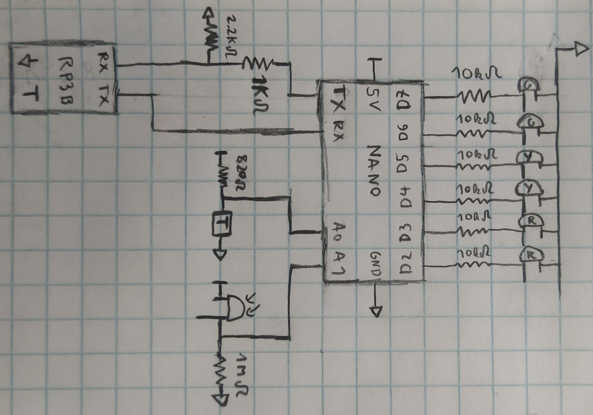
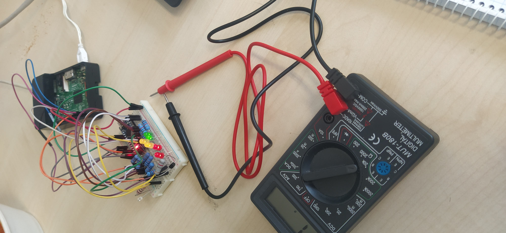
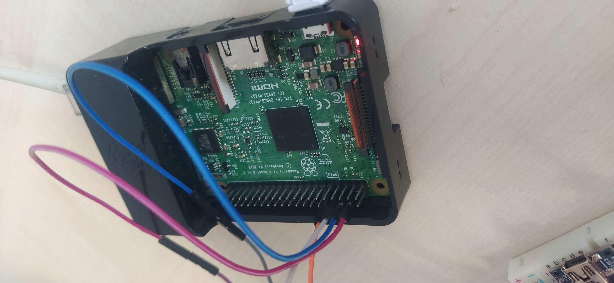
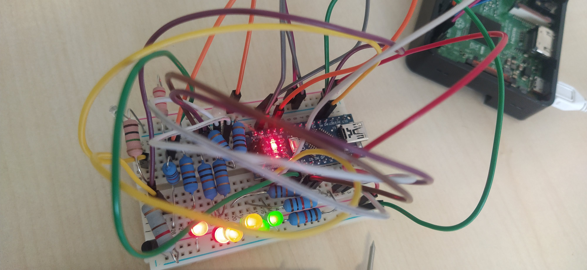
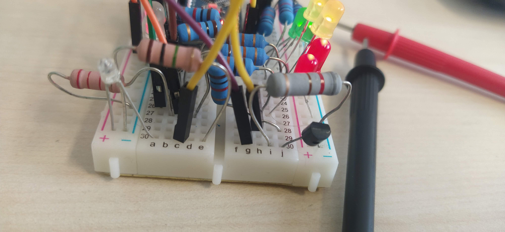

[Forráskód](https://github.com/asztrikx/hw-starter)

[Publikus oldal](http://152.66.182.62/index.html)

# Feladat
A cél egy olyan rendszer elkészítése, mely képes a hőmérsékletet, a fényt és a széndioxidod mennyiséget mérni, hogy azokat változását adott intervallumokban össze tudja hasonlítani. Például érdekes kísérlet lett volna megvizsgálni milyen gyorsan cserélődik ki az elhasznált levegő és ez idő alatt hogyan csökken a hőmérséklet. Azonban ilyen mértékű CO2 koncentrációt mérni képes szenzor csak nagyon drágán található a piacon így ez a komponens nem került beépítésre.

# Alkatrészek
| #   | Név                 | Feladat                                                   | Adatlap                                                                                          |
| --- | ------------------- | --------------------------------------------------------- | ------------------------------------------------------------------------------------------------ |
| 1   | Arduino Nano        | Analóg mintavételezés                                     | -                                                                                                |
| 2   | Raspberry PI 3B     | Arduino adatainak fogadása, feldolgozása, kiszolgálása    | -                                                                                                |
| 3   | Hőmérséklet szenzor |                                                           | https://arwill.hu/termekek/felvezetok/szenzorok-erzekelok/kty81-120-homerseklet-erzekelo-559650/ |
| 4   | Fotótranzisztor     | Fényerősség mérése                                        | https://arwill.hu/termekek/optotechnika-kijelzes/infra-vevok/ll304-pdd2e-fotodioda-640515/       |
| 5   | LED-ek              | Eredetileg CO2 szint, jelenleg fényerősség mutatása       | -                                                                                                |
| 6   | 2W Ellenállások     |                                                           | -                                                                                                |
| 7   | BreadBoard 90x50    | Áramköri egységek stabilan, összekötések segítése tartása | -                                                                                                |
| 7   | Breadboard kábelek  | Breadboardon szükséges összekötettésekhez                 | -                                                                                                |

# Áramköri ábra
Az áramkörnekben az Arduino a RP3 5V és GND értékeit használta.

A köztük lévő kommunikáció a Nano felől feszültségosztással történt meg (5V -> 3.3V), míg a másik oldal felől nem kellett vezetéken kívül más, hiszen a 3.3V körüli értékek az Arduinonál magasként vannak még értelmezve, küszöbfeszültséget megvizsgálva.

Az egyes eszközök során az adatlapon vagy interneten megtalált adatok alapján állítottam össze az áramkört.

A fotótranzisztor esetében a magas ellenállás a kis áram miatt szükséges, hiszen ezzel növelhető a mért feszültség értéke.

A hőmérsékletmérő esetén nem a táblázatban előírt 1mA áram utazik, így korrekció lenne szükséges, hogy tudjuk adott ellenálláshoz mennyi fok tartozik. Mivel a szobahőmérsékletet nem tudtam meghatározni, így becsült ambiens hőmérséklet alapján korrigáltam, feltételezve, hogy a vizsgált foktartományban (10-30 fok) lineáris görgbe (7.686*x + 808.4) konstans szorzóban tér el.

# Képek

# Videók
[Fényerősség](http://152.66.182.62/light.mp4)

[Hőmérséklet](http://152.66.182.62/temp.mp4)

# Arduino
Az arduino beszerelésének eredeti oka az analóg lábak voltak. (Bár lehetett volna ehhez olcsóbb áramkört is használni).
Azonban a jelenlegi adatfolyam architektúrában az áramkörrel való kommunikációért felelős, így ennél többet nem is tartalmaz a forráskódja.

Kimenete a kinyert hőmérséklet és fényerő adatok JSON formátumban a TX pinjén.

Az RX pinen érkező bemenete a LED-eket vezérlő LED állapot leíró JSON üzenet. Bár ezek meghatározását meg lehetett volna tenni helyben, azonban magasabb szintre áthelyezve nagyobb szabadság és egyszerűség van annak módosításában. A fejlesztés során ennek köszönhetően rétegesen tudtam haladni a fejlesztésben, amikor készen voltam a még csak papíron létező kommunikációs "szabvány" megvalósításával, akkor már nem kellett az arduino kódot módosítanom. Hasonlóan történt ez az RP3 kód fejlesztése során.

[/arduino/*](https://github.com/asztrikx/hw-starter/tree/master/arduino)

# RP3
A Raspberry Pi 3B feladata a feszültség adatok feldolgozása volt (nagyobb szabadság található itt az eszközök terén) és a hozzájuk tartozó mennyiségek rendelkezésre bocsátása volt mások számára.

Az RP3 bizotsította az Arduino számára a referencia feszültségeket (5V, GND). Erre azért volt szükség mivel ha USB-n keresztül nyújtottam volna ezeket akkor a TX és RX pinek letiltásra kerültek volna. Bár az USB-n keresztüli kommunikció egyszerű lett volna, de így minimálisan az órán tanultakat is kihasználtam és több lehetségem volt a gyakorlásra hardware téren.

A Pythonban fejlesztett API segítségével vagy le tudjuk kérni az összes adatot visszamenőlegesen, amik perzisztensen vannak tárolva SQLite adatbázisban, vagy le tudjuk kérni a legutoljára beérkezett adatokat ("/data", "/dataAll"). Látható, hogy ezek egyike se van hatékonyan implementálva, de a feladat szempontjából nem ezen volt a hangsúly.

[/rpi/*](https://github.com/asztrikx/hw-starter/tree/master/rpi)

# Client
Az adatok megjelenítésért egy kliens a felelős, ami tetszőleges helyen futhat, felhasználva az RP3 által rendelkezésre bocsátott adatokat.

Jelen esetben a webes klienst a Python alkalmazásból hostolva elérhetővé tettem [ezen az oldalon](http://152.66.182.62/index.html).

[/ui/*](https://github.com/asztrikx/hw-starter/tree/master/ui)
