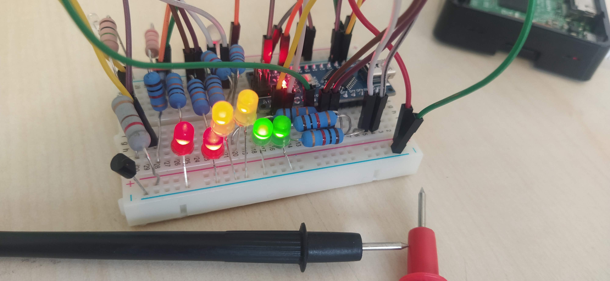

# Feladat
Az alap elképzelés egy olyan rendszer lett volna, mely képes a hőmérsékletet, a fényt és a széndioxidod mennyiséget mérni, hogy össze tudja azok változását adott intervallumokban, azonban áltlagos koncentrációt mérni képes szenzor csak nagyon drágán található a piacon így ez komponens nem került beépítésre.

# Alkatrészek
| #   | Név                 | Feladat                                                   | Link                                                                                             |
| --- | ------------------- | --------------------------------------------------------- | ------------------------------------------------------------------------------------------------ |
| 1   | Arduino Nano        | Analóg mintavételezés                                     | -                                                                                                |
| 2   | Raspberry PI 3B     | Backend futtatása, Arduino adatainak fogadása             | -                                                                                                |
| 3   | Hőmérséklet szenzor | Szobában található hőmérséklet mérése                     | https://arwill.hu/termekek/felvezetok/szenzorok-erzekelok/kty81-120-homerseklet-erzekelo-559650/ |
| 4   | Fotótranzisztor     | Fény mérése                                               | https://arwill.hu/termekek/optotechnika-kijelzes/infra-vevok/ll304-pdd2e-fotodioda-640515/       |
| 5   | LED-ek              | Eredetileg CO2 szint, jelenleg fény erősség mutatása      |                                                                                                  |
| 6   | 2W Ellenállások     |                                                           |                                                                                                  |
| 7   | BreadBoard 90x50    | Áramköri egységek stabilan, összekötések segítése tartása |                                                                                                  |
| 7   | BreadBoard kábelek  | Breadboardon szükséges összekötettésekhez                 |                                                                                                  |

# Áramköri ábra
Az áramkörnekben az Arduino a RP3 5V és GND értékeit használta.

A köztük lévő kommunikáció a Nano felől feszültségosztással történt meg (5V -> 3.3V), míg a másik oldal felől nem kellett vezetéken kívül más, hiszen a 3.3V az Arduinonál magasként van értelmezve.

Az egyes eszközök során az adatlapon vagy interneten megtalált adatok alapján állítottam össze az áramkört. A fotótranzisztor esetében a magas ellenállás a kis áram miatt szükséges, hiszen ezzel növelhető a mért feszültség értéke.


# Képek





# Arduino
Az arduino az áramkörre való kommunikációért volt felelős.

A kritikus rész az analóg lábak olvasása volt, mivel ezt raspberry segítségével nem tudtam volna megtenni.

Kimenete a TX pinjén a kinyert hőmérséklet és fényerő adatok JSON formátumban.

Bemenete az RX pinjén a LED-ek jelenlegi állapotát leíró JSON vezérlő üzenet. Bár ezek meghatározását meg lehetett volna tenni helyben, azonban magasabb szintre áthelyezve nagyobb szabadság van annak módosításában.

```arduino
#include "ArduinoJson-v6.19.4.h"

struct LedControl {
  boolean ledGreen0;
  boolean ledGreen1;
  boolean ledYellow0;
  boolean ledYellow1;
  boolean ledRed0;
  boolean ledRed1;
};

LedControl ledControl = {
    .ledGreen0 = true,
    .ledGreen1 = false,
    .ledYellow0 = false,
    .ledYellow1 = false,
    .ledRed0 = false,
    .ledRed1 = false,
};

void setup() {
  Serial.begin(9600);

  // Leds: digital
  for(int i=2; i<=9; i++) {
    pinMode(i, OUTPUT);
  }
}

void loop() {
  int light = analogRead(A0);
  int temperature = analogRead(A1);
  tx(light, temperature);

  rx();
  //8.9 unused
  digitalWrite(7, boolToVoltage(ledControl.ledGreen0));
  digitalWrite(6, boolToVoltage(ledControl.ledGreen1));
  digitalWrite(5, boolToVoltage(ledControl.ledYellow0));
  digitalWrite(4, boolToVoltage(ledControl.ledYellow1));
  digitalWrite(3, boolToVoltage(ledControl.ledRed0));
  digitalWrite(2, boolToVoltage(ledControl.ledRed1));
  
  delay(500);
}

int boolToVoltage(bool b) {
    return b ? HIGH : LOW;
}

void tx(int light, int temperature) {
  // Arduino can't handle stringstream;

  DynamicJsonDocument doc(1024);
  doc["light"] = light;
  doc["temperature"] = temperature;

  serializeJson(doc, Serial);
  Serial.println("");
}

void rx() {
  if (Serial.available() > 0) {
    String json = Serial.readStringUntil('\n');

    DynamicJsonDocument doc(1024);
    deserializeJson(doc, json);

    ledControl.ledGreen0 = doc["ledGreen0"];
    ledControl.ledGreen1 = doc["ledGreen1"];
    ledControl.ledYellow0 = doc["ledYellow0"];
    ledControl.ledYellow1 = doc["ledYellow1"];
    ledControl.ledRed0 = doc["ledRed0"];
    ledControl.ledRed1 = doc["ledRed1"];
  }
}
```

# RP3
A Raspberry Pi 3B feladata a feszültség adatok feldolgozása és a hozzájuk tartozó mennyiségek rendelkezésre bocsátása volt, amellett hogy biztosította a referencia feszültségeket.

Az API segítségével vagy le tudjuk kérni az összes adatot, amik perzisztensen vannak tárolva SQLite adatbázisban, vagy le tudjuk kérni a legutoljára beérkezett adatokat.

```python
import json
import sqlite3
import threading
from datetime import datetime
from math import ceil

import serial
from flask import Flask, jsonify

ser = serial.Serial("/dev/ttyS0", 9600)
api = Flask(__name__)


@api.route('/data', methods=['GET'])
def get():
    return jsonify({
        "temperature": lastTemperature,
        "light": lastLight,
    })


@api.route('/dataAll', methods=['GET'])
def getAll():
    con = sqlite3.connect("sensor.db")
    cur = con.cursor()
    res = cur.execute("SELECT date, sensorType, value FROM data")
    rows = res.fetchall()
    structs = []
    for row in rows:
        structs.append({
            "date": row[0],
            "sensorType": row[1],
            "value": row[2],
        })
    cur.close()
    con.close()
    return jsonify(structs)


def uartRead():
    global con
    con = sqlite3.connect("sensor.db")
    while True:
        jsonData = ser.readline()
        # try:
        data = json.loads(jsonData)
        handleTemperatureVoltage(data["temperature"])
        handleLightVoltage(data["light"])
        # except:
        #    print("data read error")
        #    continue


lastTemperature = 1000
lastTemperatureStoreDate = ""


def handleTemperatureVoltage(temperatureVoltage):
    #print("Temp voltage: " + str(temperatureVoltage))
    temperatureVoltage *= 1.7
    # 7.686*X + 808.4
    temperature = (temperatureVoltage - 808.4) / 7.686
    global lastTemperature, lastTemperatureStoreDate
    lastTemperature = temperature

    if (currentDate() != lastTemperatureStoreDate):
        lastTemperatureStoreDate = currentDate()
        storeData("temperature", temperature)


lastLight = 600
lastLightStoreDate = ""


def handleLightVoltage(lightVoltage):
    #print("Light voltage: " + str(lightVoltage))
    light = lightVoltage
    global lastLight, lastLightStoreDate
    lastLight = light

    handleLightLeds(light)

    if (currentDate() != lastLightStoreDate):
        lastLightStoreDate = currentDate()
        storeData("light", light)


def storeData(sensorType, value):
    data = [
        currentDate(), sensorType, value,
    ]
    cur = con.cursor()
    cur.execute("""
        INSERT INTO data (date, sensorType, value)
        VALUES (?,?,?)
    """, data)
    con.commit()
    cur.close()


def handleLightLeds(light):
    lightMin = 400
    lightMax = 1000
    ledCount = 6

    unit = (lightMax - lightMin) / ledCount
    x = min(light, lightMax)
    x = max(light, lightMin)
    led = ceil((x - lightMin) / unit)

    ledControl = {
        "ledGreen0": led >= 1,
        "ledGreen1": led >= 2,
        "ledYellow0": led >= 3,
        "ledYellow1": led >= 4,
        "ledRed0": led >= 5,
        "ledRed1": led >= 6,
    }
    ser.write((json.dumps(ledControl) + "\n\r").encode())


def currentDate():
    return datetime.now().strftime("%Y-%m-%d %H:%M:%S")


if __name__ == '__main__':
    threading.Thread(target=uartRead).start()
    api.run(host='0.0.0.0', port=80)
```

# Client
Az adatok megjelenítésért egy kliens a felelős, ami tetszőleges helyen futhat, felhasználva az RP3 által rendelkezésre bocsátott adatokat.
A kliens megírására a flutter esett választásul, mivel cross platform appokat képes rendelkezésre bocsátani.

Sajnos míg a többi komponens teljesen elkészült, addig a választott chart megjelenítésért felelős libraryt nem sikerült live adatok megjelenítésére bírni

```dart
import 'dart:ui';

import 'package:dio/dio.dart';
import 'package:flutter/material.dart';
import 'package:flutter/services.dart';
import 'package:syncfusion_flutter_charts/charts.dart';
import 'dart:async';
import 'package:intl/intl.dart';

var dio = Dio();

void main() {
  runApp(const MyApp());
}

class MyApp extends StatelessWidget {
  const MyApp({super.key});

  @override
  Widget build(BuildContext context) {
    return MaterialApp(
      title: 'IoT',
      theme: ThemeData(
        primarySwatch: Colors.blue,
      ),
      home: const MyHomePage(title: 'IoT'),
    );
  }
}

class MyHomePage extends StatefulWidget {
  final String title;

  const MyHomePage({super.key, required this.title});

  @override
  State<MyHomePage> createState() => _MyHomePageState();
}

class _MyHomePageState extends State<MyHomePage> {
  List<Temperature> temperatures = [
    Temperature(DateTime.now(), 0),
  ];
  late SimpleChart<Temperature> temperatureChar;

  load() async {
    var response = await dio.get('http://152.66.182.62/dataAll');
    var datas = (response.data as List<dynamic>);
    datas.retainWhere((element) => element["sensorType"] == "temperature");
    var temperatures = datas.map((t) => Temperature(DateTime.parse(t["date"]), t["value"])).toList();
    this.temperatures = (temperatures as List<dynamic>).sublist(temperatures.length - 1 - 100, temperatures.length) as List<Temperature>;

    Timer.periodic(const Duration(seconds: 1), (timer) async {
      var response = await dio.get('http://152.66.182.62/data');
      var temperature = response.data["temperature"];

      temperatures.add(Temperature(DateTime.now(), temperature));
      if (temperatures.first.timeOfDay.minute == temperatures.last.timeOfDay.minute && temperatures.first.timeOfDay.hour != temperatures.last.timeOfDay.hour) {
        temperatures.removeAt(0);
        temperatureChar.chartSeriesController.updateDataSource(
          addedDataIndex: temperatures.length - 1,
          removedDataIndex: 0,
        );
      } else {
        temperatureChar.chartSeriesController.updateDataSource(
          addedDataIndex: temperatures.length - 1,
        );
      }
    });
  }

  _MyHomePageState() {
    load();
  }

  String _xLabelStringify(dynamic temperature) { // dart variance is bad
    temperature as Temperature;
    return DateFormat('%H:%M:%S').format(temperature.timeOfDay);
  }

  num _yLabelStringify(dynamic temperature) {
    temperature as Temperature;
    return temperature.value;
  }

  @override
  Widget build(BuildContext context) {
    return Scaffold(
      appBar: AppBar(
        title: Text(widget.title),
      ),
      body: Center(
        child: Column(
          mainAxisAlignment: MainAxisAlignment.center,
          children: <Widget>[
            temperatureChar = SimpleChart<Temperature>(
              title: "Temperature",
              xLabelStringify: _xLabelStringify as Stringify,
              yLabelStringify: _yLabelStringify as Stringify2,
              tooltipStringify: "point.y\npoint.x",
              datas: temperatures,
            ),
          ],
        ),
      ),
    );
  }
}

typedef Stringify = String Function(dynamic);
typedef Stringify2 = num Function(dynamic);

class SimpleChart<T> extends StatefulWidget {
  final String title;
  final List<T> datas;
  final Stringify xLabelStringify;
  final Stringify2 yLabelStringify;
  final String tooltipStringify;
  late ChartSeriesController chartSeriesController;

  SimpleChart({
    required this.title,
    required this.datas,
    required this.xLabelStringify,
    required this.yLabelStringify,
    required this.tooltipStringify,
    super.key
  });

  @override
  State<SimpleChart> createState() => SimpleChartState<T>();
}

class SimpleChartState<T> extends State<SimpleChart> {
  @override
  Widget build(BuildContext context) {
    return SfCartesianChart(
      primaryXAxis: CategoryAxis(
        majorGridLines: MajorGridLines(width: 0),
        labelPlacement: LabelPlacement.onTicks,
      ),
      primaryYAxis: NumericAxis(
        majorGridLines: MajorGridLines(width: 1),
        interval: 5,
      ),
      title: ChartTitle(text: widget.title),
      plotAreaBorderWidth: 0,
      tooltipBehavior: TooltipBehavior(
        enable: true,
        header: "",
        canShowMarker: false,
        format: widget.tooltipStringify,
        textAlignment: ChartAlignment.center,
      ),

      series: <SplineAreaSeries<T, String>>[
        SplineAreaSeries<T, String>(
          color: Color.fromARGB(128, 75, 135, 185),
          enableTooltip: true,
          dataSource: widget.datas as List<T>,
          xValueMapper: (T data, _) => widget.xLabelStringify(data),
          yValueMapper: (T data, _) => widget.yLabelStringify(data),
          onRendererCreated: (ChartSeriesController c) {
            widget.chartSeriesController = c;
          }
        )
      ]
    );
  }
}

class Temperature {
  final DateTime timeOfDay;
  final double value;
  
  Temperature(this.timeOfDay, this.value);
}
```
